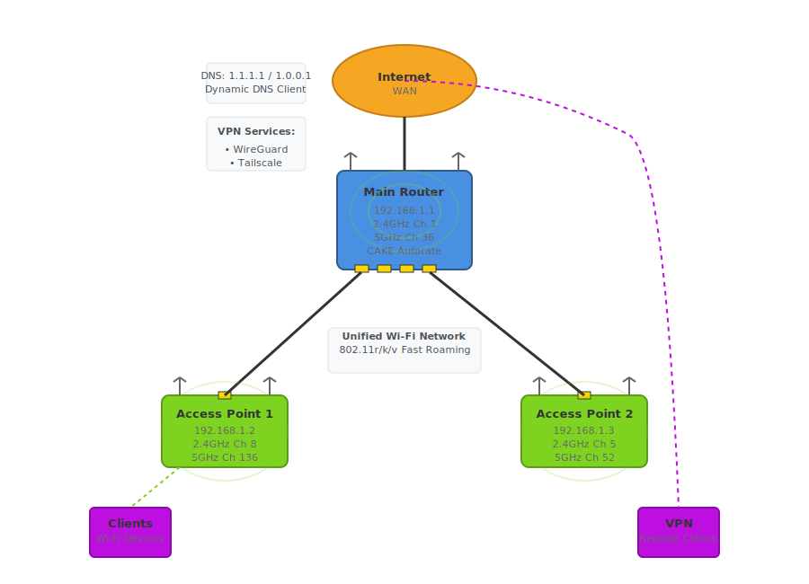

# Ansible OpenWrt

This Ansible playbook provisions an OpenWrt network from factory defaults. It automatically configures:

- Automatic WAN bandwidth management (CAKE Autorate)
- Wi‑Fi with fast client roaming across all OpenWrt devices
- WireGuard server to access LAN devices with easy QR-code client setup
- Tailscale client with subnet routing
- Dynamic DNS via [no-ip.com](https://www.noip.com/) and [FreeDNS (Afraid)](https://freedns.afraid.org/)
- Hostnames
- Timezones
- WAN DNS servers

## Network Diagram



## Install Ansible and run the playbook

On Windows, use WSL (Ubuntu/Debian) to run Ansible. Quick steps in WSL:

```bash
sudo apt update
sudo apt install -y python3 python3-pip
pip install --upgrade pip
pip install ansible
ansible-galaxy collection install community.openwrt
```

Create a vault password file containing only your password on the first line:

```bash
nano ~/.vaultfile
```

Clone this repository and change into its directory.

Copy `vault_example.yml` to `group_vars/all/vault.yml` and update the variables:

```bash
cp vault_example.yml group_vars/all/vault.yml

# Encrypt a vault file (first time)
ansible-vault encrypt group_vars/all/vault.yml

# Edit an encrypted vault file
ansible-vault edit group_vars/all/vault.yml

# View vault contents without editing
ansible-vault view group_vars/all/vault.yml
```

Edit `hosts.yml` for your setup. An example is provided. Change the wifi device paths to suit your device using `cat /etc/config/wireless` otherwise might need to factory reset device to find the correct device paths.

Run the playbook:

```bash
export ANSIBLE_CONFIG=./ansible.cfg
ansible-playbook site.yml
```

## Access Points Setup

By default, OpenWrt devices share the same factory default settings. This is fine for the main router but not ideal for access points. Before connecting access points to your network and running this Ansible playbook, update their basic settings via LuCI.

1. Preparation

- Connect the OpenWrt access point only to your computer via an Ethernet cable.
- Do not connect it to your main router yet to avoid IP conflicts.

2. Disable the firewall and DHCP; set a static LAN IP

- Log in to LuCI (default 192.168.1.1).
- Navigate to Network → Interfaces and click Edit on the LAN interface.
- Under General Setup:
	- Set the IPv4 address to an unused IP in your main router's subnet (e.g., if your main router is 192.168.1.1, use 192.168.1.2).
	- Set the IPv4 gateway to your main router's IP (e.g., 192.168.1.1).
	- Set "Use custom DNS servers" to your main router's IP.
- In DHCP Server → General Setup, check "Ignore interface" to disable DHCP on this device.
- Under the IPv6 Settings tab, disable RA-Service and disable DHCPv6.

Save and apply the changes, then reconnect the device to your main network.

## CAKE Autorate note

A custom CAKE autorate config file can be placed at `/custom_files/config.primary.sh` which are git ignored.

## Tailscale

This Ansible playbook cannot fully automate the security approvals required by the Tailscale platform itself and some manual steps are required:
- Approve Subnet Routes: Go to the Tailscale Admin Console, click the three-dot menu (...) 
  for your OpenWrt router, select Edit route settings, and check the box for your subnet.
- Client Configuration: On your remote device (phone/laptop), ensure the Tailscale app setting 
  "Use Tailscale Subnets" is toggled ON to reach your LAN devices.

## Wireguard tips

- Setup a Dynamic DNS service
- To add the Wireguard client to your device with a QR code:
	- On the main router (192.168.1.1), navigate to Network → Interfaces and click Edit on the Wireguard interface.
	- With the Wireguard interface settings open, navigate to Peers tab, click Edit for client1
	- At the bottom, click Configuration Export
	- Set the Connection Enpoint to your Dynamic DNS service
	- In the Wireguard app on your device, press add and scan QR code
